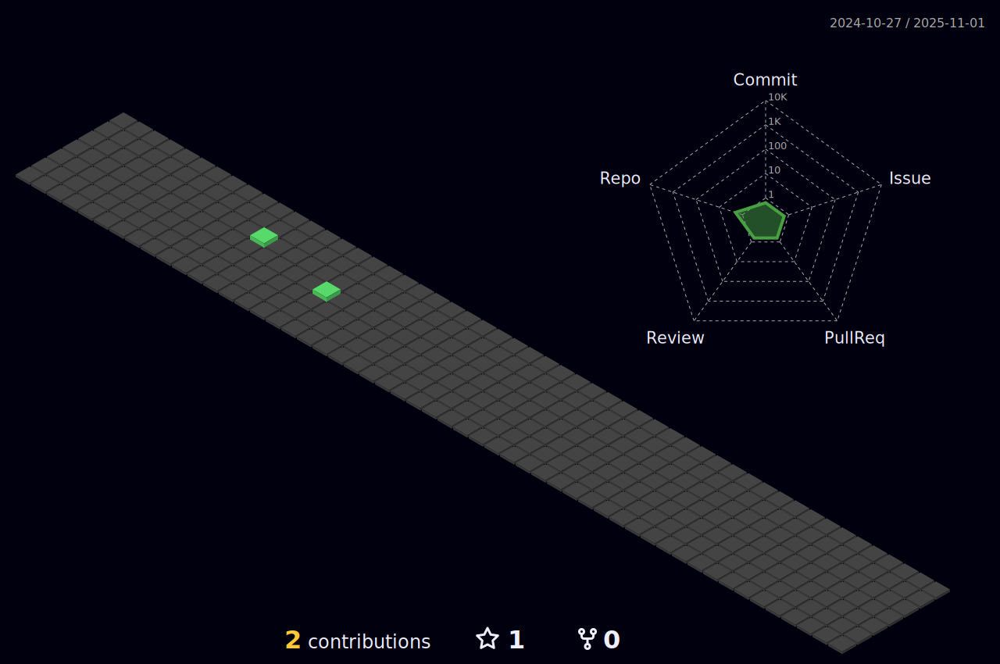

<h1 align="center">
  
</h1>

## About Me

- 🖥 A frontend engineer at Bytedance now.
- 🌍 I’m currently working on Shenzhen China.

## Contact

- 📫 [396037577@qq.com](mailto:396037577@qq.com)

## Some Languages and Tools I Use

#### Languages

<code></code>
<code></code>
<code></code>
<code></code>

#### Frontend Libraries

<code></code>
<code></code>
<code></code>
<code></code>
<code></code>
<code></code>

#### Backend Libraries

<code></code>
<code></code>

#### DB

<code></code>
<code></code>
<code></code>
<code></code>

#### OS/Cloud

<code></code>
<code></code>
<code></code>
<code></code>
<code></code>
<code></code>

